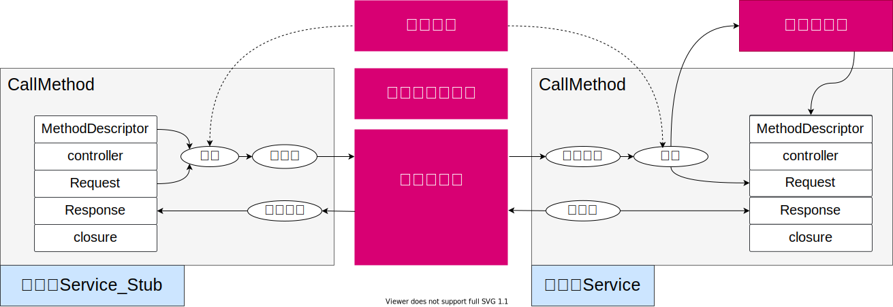

# 1 概述

mpzRPC是基于C++实现的RPC分布式网络通信框架，框架基于muduo高性能网络库、protobuf数据交换、Zookeepr服务注册中间件开发，即mpzRPC。mpzRPC在客户端隐藏了通信和连接过程，在服务端提供了简洁本地服务发布注册接口，整体高效易用。

## 1.1 设计思路 

protofbuf原生提供了基于rpc service方法调用代码框架，无需实现对服务接口的描述，只需要关注服务管理和rpc通信流程；其次，protobuf基于二进制序列化数据的，同带宽具有更高的通信效率；因此，采用protobuf为基础，整体框架初始构想如下；



灰色区域由protobuf提供，红色区域是框架的待开发部分：

- 服务映射表：记录服务端发布的本地服务名称和服务对象；当客户端发起调用时，输入RPC方法名->查表->取服务对象->调用；
- 服务注册中间件：服务端在将发布的服务进行注册，客户端根据服务、方法名从服务注册中间件获取服务所在机器的URL，从而定位通信对象；
- 网络中间件：RPC请求的发送和服务调用响应的返回，需要网络中间件实现客户端和服务端的通信；
- 通信协议：客户端调用一个远程RPC服务，需要提供服务名称、方法名称、方法输入参数，因此客户端打包这些参数和服务端解包需要提前约定一个通信协议；

## 1.2 框架设计


- 服务映射表：由provider类->publicService实现本地服务发布为RPC服务；
- 服务注册中间件：利用Zookeeper的服务注册功和发现能，具有两方便优势，其一，客户端和服务端解耦，客户端无需手动修改服务URL配置文件；其二，提供者和服务中心间存在心跳检测和服务协调，实时检测更新提供服务的URL；
- 网络中间件：采用muduo网络库实现通信，muduo库采用one loop per thread设计，多线程并发执行多个事件循环，每个事件循环采用非阻塞+epoll作为IO模型，性能优秀；
- 通信协议：head_size+head_str+request_str设计，其中head_str中包含request_size信息，避免Tcp粘包；

## 1.3 交互流程

1. 发布本地服务，在服务端，通过provider->publishService将本地服务封装成可被远程调用的rpc服务，并添加到服务映射表；
2. 启动服务，provider->run启动TcpServer,并创建一个监听fd->acceptFd；将服务映射表上的RPC服务注册到ZooKeeper;
3. 客户端发起调用，根据目标服务名、方法名，从ZooKeeper上获取RPC方法所在URL；按通信协议打包数据包，序列化后通过clientFd连接TcpServer,发送数据包；
4. 建立连接，当客户端连接acceptFd成功时，acceptFd返回connFd与clientFd组成TCP链路，并创建对应TcpConnection对象；
5. 服务端接收数据，客户端发送数据包写入服务端connFd读缓冲区时，触发TcpConnection对象的onMessageCallback回调；
6. 服务端解包，在onMessageCallback回调中，反序列化后，按通信协议解包，通过包中rpc方法名查服务映射表获取对应service、MethodDescribe对象,通过包中request_str构建Request对象；
7. 服务端绑定回调，将provider的sendResponse设置为callMethod中的closure关闭回调对象；
8. 服务端调用，在onMessageCallback回调中，service对象->callMethod->执行rpc method->执行local method->返回值写入Response对象->触发关闭回调sendResponse；
9. 服务端返回，sendResponse中将response序列化后返回客户端，客户端clientFd通过recv接收并反序列化后从response对象中获取调用结果，至此完成一轮rpc调用，关闭Tcp连接；

# 2 安装

## 2.1 安装依赖库

- [protobuf](https://github.com/protocolbuffers/protobuf)
- [ZooKeeper](https://github.com/apache/zookeeper)
- [muduo](https://github.com/chenshuo/muduo)
- [cmake](https://github.com/Kitware/CMake)
- [json](https://github.com/nlohmann/json)

## 2.2 编译

克隆

```shell
git clone https://github.com/wangzyon/mpzRPC
```

编译

```shell
cd ./mpzRPC && sudo ./autobuild.sh
```

# 3 使用

<!-- tabs:start -->

#### 定义RPC接口

```protobuf
// protobuf版本
syntax = "proto3"; 
// 包名，在C++中表现为命名空间
package example;
// 生成service服务类的描述，默认不生成
option cc_generic_services=true;
// 状态
message ResultCode
{
    int32 errcode = 1;
    bytes errmsg = 2;
}
// 请求
message LoginRequest
{
    bytes name=1;
    bytes pwd=2;
}
// 响应
message LoginResponse
{
    ResultCode result=1;  // 复合message
    bool success = 2;
}
// 定义RPC接口
service UserRpcService
{
    rpc Login(LoginRequest) returns(LoginResponse);
}
```

#### 发布RPC服务

```cpp
#include <iostream>
#include <mpzrpc/mpzrpcapplication.h>
#include <mpzrpc/mpzrpcprovider.h>
#include "example.service.pb.h"

class UserService : public example::UserRpcService
{
public:
    
    bool Login(const std::string &name, const std::string pwd) // 本地服务
    {
        std::cout << "local service: Login" << std::endl;
        std::cout << "name:" << name << "pwd" << std::endl;
        return pwd == "123";
    }
    void Login(::google::protobuf::RpcController *controller, // RPC服务
               const ::example::LoginRequest *request,
               ::example::LoginResponse *response,
               ::google::protobuf::Closure *done)   
    {
        // 框架给业务上报了请求参数LoginRequest，应用获取相应数据做本地业务
        std::string name = request->name();
        std::string pwd = request->pwd();
        // 做本地业务
        bool ret = Login(name, pwd);
        response->set_success(ret);
        // 把响应写入，包括错误码、错误消息、返回值
        example::ResultCode *result_code = response->mutable_result();
        result_code->set_errcode(0);
        result_code->set_errmsg("");
        // 执行回调操作, 执行响应对象数据的序列化和网络发送（都是由框架来完成的）
        done->Run();
    };
};

int main(int argc, char **argv)
{
    MpzrpcApplication::init(argc, argv);  
    std::cout << MpzrpcApplication::getApp().getConfig().getRpcServerIp() << std::endl;
    MpzrpcProvider provider; 
    provider.publishService(new UserService()); // 2.发布服务（将本地Login发布为RPC Login）
    provider.run(); // 3.启动服务
    return 0;
};
```

#### 调用RPC服务

```cpp
#include <iostream>
#include "example.service.pb.h"
#include <mpzrpc/mpzrpcchannel.h>
#include <mpzrpc/mpzrpcapplication.h>

int main(int argc, char **argv)
{	
    // 1.初始化框架 
    MpzrpcApplication::init(argc, argv); 
    // 2.在客户端创建服务调用类对象stub
    example::UserRpcService_Stub stub(new MpzrpcChannel()); 
    // 3.创建RPC调用的请求对象和响应对象；
    example::LoginRequest request;
    request.set_name("zhang san");
    request.set_pwd("123456");
    example::LoginResponse response;
    // 4.调用
    stub.Login(nullptr, &request, &response, nullptr);
    // 5.打印响应结果
    if (0 == response.result().errcode())
    {
        std::cout << "rpc login response success:" << response.success() << std::endl;
    }
    else
    {
        std::cout << "rpc login response error : " << response.result().errmsg() << std::endl;
    }
    return 0;
}
```
